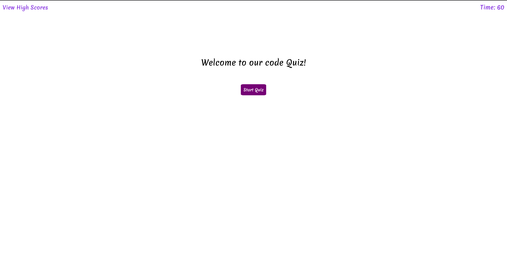

# WebApi-Code-Quiz

### This Web Application is a Coding quiz with question on JavaScript and Web APIs. 

The quiz prompts the user with questions, and if they get them wrong, the time left decreases, in addition to counting down as well. The quiz ends when time runs out or all questions are answered. Afterwards, the user can save their score and intials.

You can access the Web App here: [Code Quiz Web App](https://saumilkt.github.io/WebApi-Code-Quiz/)
